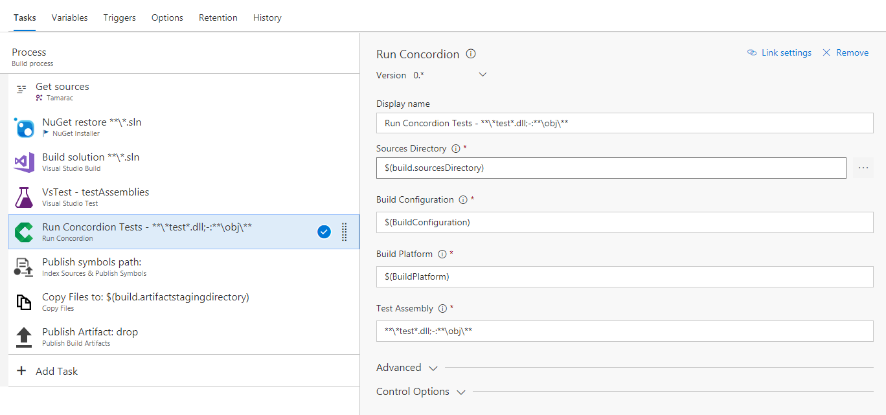

## Run Concordion Tests

This task will run Concordion tests using NUnit console. Currently, addins do not work with the NUnit test adapters ([see Github issue here](https://github.com/nunit/nunit3-vs-adapter/issues/222)).

## Settings

The task requires the following settings:

1. **Sources Directory**: the directory to search for test DLLs - default is `$(Build.SourcesDirectory)`
2. **Build Configuration**: the build configuration
3. **Build Platform**: the build platform
4. **Test Assembly**: the pattern to use to find the test assembly (supports glob patterns)